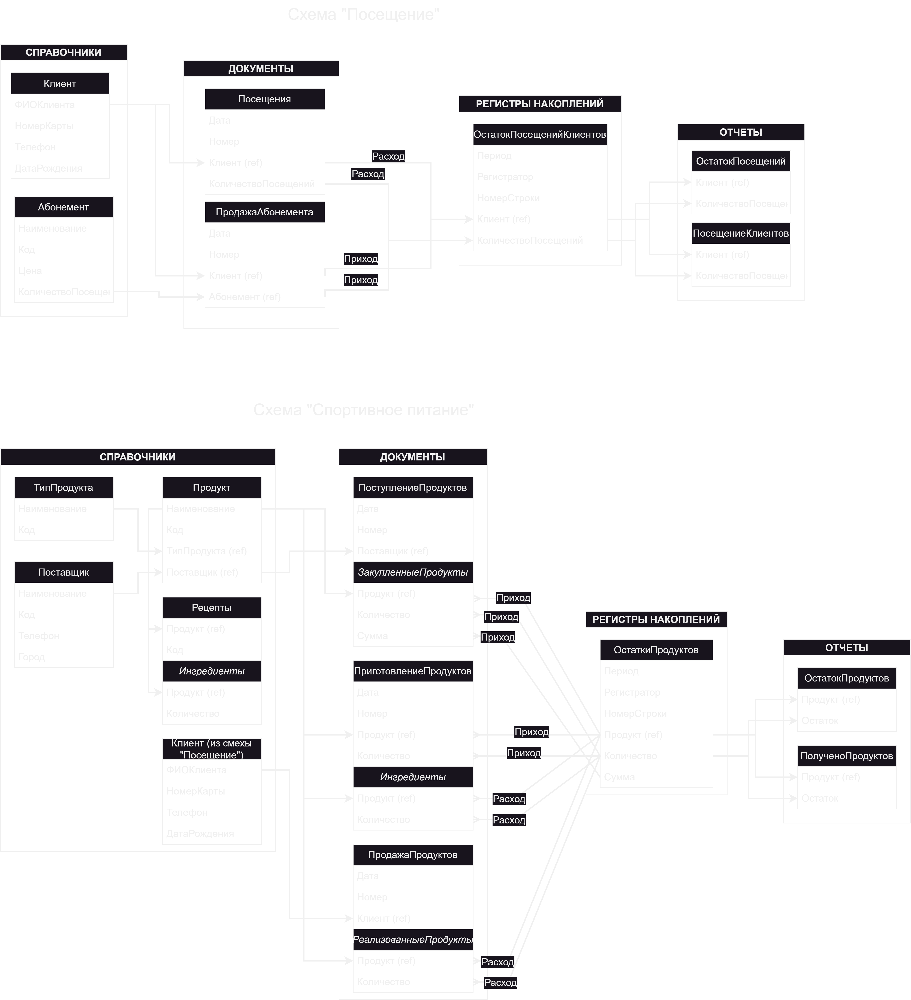

# 🏋️‍♂️ Проект "Учёт спортзала" (1С:Предприятие)

## 📖 Описание

Учебный проект, созданный для практической отработки навыков разработки на платформе **1С:Предприятие 8.3**.
Цель — автоматизация ключевых процессов работы спортзала:

* учёт посещений клиентов;
* учёт продажи, поступления и приготовления спортивного питания.

Реализация охватывает полный цикл разработки в 1С: от проектирования структуры базы до обработки краевых случаев в коде.

## ⚙️ Основные возможности

### Модуль "Посещения"

* Ведение справочника клиентов и абонементов.
* Учёт посещений и продаж абонементов через документы.
* Автоматическое списание и контроль количества оставшихся посещений.
* Отчёты по остаткам и истории посещений.

### Модуль "Спортивное питание"

* Учёт поступлений и продаж продуктов.
* Работа со справочниками поставщиков, категорий товаров и рецептов.
* Формирование регистра накопления по количеству и сумме.
* Отчёты по остаткам и движениям товаров.
* Приготовление продуктов: возможность создавать продукт на основе других продуктов по рецептуре.

## 🛠️ Используемые объекты платформы

* **Справочники** (Клиенты, Абонементы, Продукты, Поставщики, Рецепты и др.).
* **Документы** (Посещение, Продажа абонемента, Поступление продуктов, Продажа продуктов, Приготовление продуктов).
* **Регистры накопления** (остатки посещений, остатки продуктов).
* **Отчёты** (по остаткам и движениям).

В проекте задействованы как типовые механизмы 1С (конструктор запросов, формы), так и ручная обработка логики на сервере и клиенте.

## 📂 Архитектура

Проект состоит из двух основных подсистем:

1. **Учёт посещений** — работа с клиентами, абонементами и регистрацией визитов.
2. **Учёт спортивного питания** — работа с продуктами, их поступлением, реализацией и приготовлением.

На схеме ниже показаны взаимосвязи справочников, документов, регистров и отчётов:

## 🔑 Ключевые аспекты реализации

* Реализованы **проверки ввода данных** и работа с формами.
* Используется **разделение кода на клиентский и серверный контекст** (`&НаКлиенте`, `&НаСервере`).
* Применяется различие между **объектом** и **элементами формы**.
* Обработка краевых случаев и проверка данных через встроенные механизмы и код.
* Использование **официальной документации 1С** и практическая работа с конструктором запросов.
* Расширенная логика: в документе **"Приготовление продуктов"** реализована работа с рецептами, автоматическое заполнение табличной части ингредиентами, проверка наличия на складе, кнопка *"Рассчитать цену"* для вычисления стоимости.
* В качестве примера работы с формами и визуальными подсказками, в списке продуктов подсвечиваются зелёным цветом товары собственного производства.

## 🚀 Как развернуть из исходников (папка `./XML`)

1. Установить платформу **1С:Предприятие 8.3**.
2. Создать пустую **файловую** базу: запустить 1С → *Добавить* → *Создание новой информационной базы* → *Пустая конфигурация* → завершить мастер.
3. Открыть созданную базу в **Конфигураторе**.
4. Меню: *Конфигурация → Загрузить конфигурацию из файлов…* → указать папку проекта `./XML` → **ОК**.

   > Если база не пустая, отметьте опцию «Удалить объекты, отсутствующие в загружаемой конфигурации».
5. Меню: *Конфигурация → Проверить* — убедиться, что нет ошибок.
6. Меню: *Конфигурация → Обновить конфигурацию базы данных…* — согласиться на обновление.
7. Запустить в режиме **1С:Предприятие** (кнопка *Запуск* или меню *Отладка → Запустить 1С:Предприятие*).
8. (Опционально) Заполнить начальные данные: справочники **Клиенты/Абонементы/Продукты/Поставщики/Рецепты**.

## 📜 Примечание

Проект учебный, но построен по канонам разработки в 1С и охватывает все основные сущности:

* справочники;
* документы;
* регистры накопления;
* отчёты.

Это позволяет использовать его как **базовый каркас** для реальных прикладных решений, а также как пример работы с различными аспектами платформы: формами, контекстом, запросами и бизнес-логикой.
